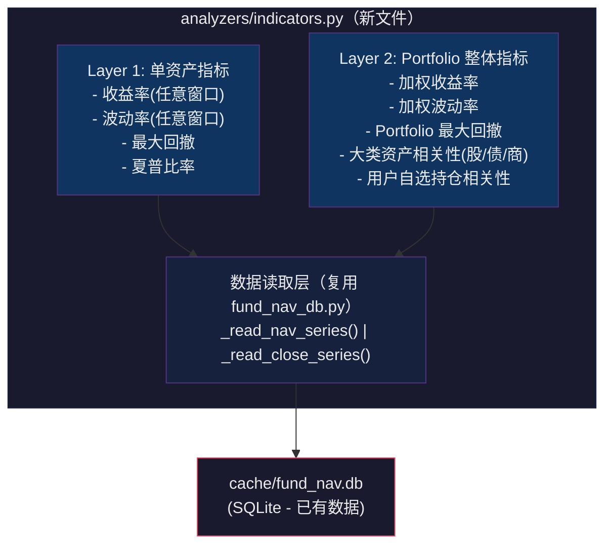

# 指标计算模块设计方案

## 一、为什么要做

当前项目已经完成了：**多平台持仓解析 → 基金穿透 → 跨平台聚合 → 历史行情缓存**。下一步要做可视化看板，但在可视化之前，需要一个**独立的指标计算层**，把原始价格/净值数据加工成有业务含义的指标（收益率、波动率、相关性等），供前端直接消费。

### 现状问题

目前的指标计算逻辑散落在 `fund_nav_db.py` 底部（约 200 行），存在以下问题：

| 问题 | 说明 |
|------|------|
| 职责不清 | 数据库 CRUD + 指标计算混在 1025 行的同一个文件里 |
| 时间窗口写死 | 只支持 1Y/3Y/5Y，不支持自定义区间和按月/按季度 |
| 没有分层 | 只算单个资产，没有 Portfolio 整体加权指标 |
| 相关性不灵活 | 全量算所有资产，不支持按用户选择、按大类资产分组 |
| 前端不好用 | 返回一个大 dict，没有标准化的查询接口给可视化层调用 |

---

## 二、总体设计



### 核心原则

1. **新建独立文件** `analyzers/indicators.py`，不改动现有 `fund_nav_db.py` 的代码（最小化修改）
2. **分两层**：Layer 1 单资产指标 + Layer 2 整体 Portfolio 指标
3. **统一接口风格**：所有指标函数都接受 `start_date` / `end_date` 参数，支持灵活时间窗口
4. **结果缓存**：计算结果保存到 `cache/indicator_results.json`，避免重复计算

---

## 三、指标详细定义

### Layer 1：单资产指标

#### 3.1 收益率（Return）

| 属性 | 定义 |
|------|------|
| **公式** | `(区间末净值 / 区间初净值) - 1` |
| **年化公式** | `(区间末净值 / 区间初净值) ^ (250 / 交易日天数) - 1` |
| **输入** | 资产代码 + 起止日期 |
| **时间窗口支持** | 近1月(1M) / 近3月(3M) / 近6月(6M) / 近1年(1Y) / 近3年(3Y) / 近5年(5Y) / 自定义(start_date, end_date) |
| **数据来源** | fund_daily_nav.unit_nav / etf_daily_hist.close / stock_daily_hist.close |

**可视化消费场景**：
- 看板上展示每个持仓的近1年收益率
- 用户拖动时间滑块，实时更新收益率

#### 3.2 波动率（Volatility）

| 属性 | 定义 |
|------|------|
| **公式** | `日收益率序列的标准差 × √252`（年化） |
| **日收益率** | `price[t] / price[t-1] - 1` |
| **输入** | 资产代码 + 起止日期 |
| **时间窗口支持** | 同收益率 |
| **数据来源** | 同收益率 |

**可视化消费场景**：
- 持仓列表中标注每个资产的波动率等级（高/中/低）
- 按不同窗口对比波动率变化

#### 3.3 最大回撤（Max Drawdown）

| 属性 | 定义 |
|------|------|
| **公式** | `min( (price - cummax(price)) / cummax(price) )` |
| **含义** | 区间内从最高点到最低点的最大跌幅 |
| **输入** | 资产代码 + 起止日期 |

#### 3.4 夏普比率（Sharpe Ratio）

| 属性 | 定义 |
|------|------|
| **公式** | `(年化收益率 - 无风险利率) / 年化波动率` |
| **无风险利率** | 默认 2%（可在 config.yaml 配置） |
| **含义** | 每承担一单位风险获得的超额收益，越高越好 |

#### 3.5 区间累计收益率序列（Return Series）

| 属性 | 定义 |
|------|------|
| **公式** | 每日 `price / price[0] - 1`，形成一条净值曲线 |
| **用途** | 给前端画"净值走势折线图"用 |

---

### Layer 2：Portfolio 整体指标

#### 3.6 加权收益率（Portfolio Return）

| 属性 | 定义 |
|------|------|
| **公式** | `Σ (单资产收益率 × 该资产权重)` |
| **权重** | `资产市值CNY / 总市值CNY`（来自 aggregated_summary） |
| **含义** | 整个组合在区间内的加权平均收益 |

#### 3.7 加权波动率（Portfolio Volatility）

| 属性 | 定义 |
|------|------|
| **公式** | `√(w^T · Σ · w)`，其中 `w` 是权重向量，`Σ` 是协方差矩阵 |
| **简化版** | 如果协方差矩阵不完整，降级为 `Σ (单资产波动率 × 权重)` |

#### 3.8 相关性矩阵（Correlation Matrix）

设计两种模式：

**模式 A：用户自选持仓**

| 属性 | 定义 |
|------|------|
| **输入** | 用户提供一组代码，如 `["000001", "161725", "00700"]` |
| **输出** | N×N 的 Pearson 相关系数矩阵 |
| **可视化** | 热力图（heatmap） |

**模式 B：大类资产相关性**

| 属性 | 定义 |
|------|------|
| **输入** | 按 level2_summary 的分类（equity / bond / commodity） |
| **做法** | 用每类资产下所有持仓的加权日收益率序列，计算类间相关系数 |
| **输出** | 3×3 矩阵（股/债/商） |
| **可视化** | 热力图 |
| **含义** | 你的组合里，股和债的联动性有多大？分散化够不够？ |

---

## 四、需要额外获取的数据

**不需要新增任何数据抓取**。所有计算都基于已有的 SQLite 数据：

| 计算所需 | 数据来源 | 已有？ |
|----------|----------|--------|
| 基金净值序列 | `fund_daily_nav` 表 | ✅ 已有 |
| ETF 价格序列 | `etf_daily_hist` 表 | ✅ 已有 |
| A股/港股/美股价格序列 | `stock_daily_hist` 表 | ✅ 已有 |
| 资产权重（市值占比） | `aggregated_summary.json` / `penetrated_holdings.json` | ✅ 已有 |
| 资产分类（股/债/商） | `level2_summary` / `true_asset_class` | ✅ 已有 |
| 无风险利率 | `config.yaml` 新增一行即可 | ⚠️ 需配置一行 |

唯一需要的改动是在 `config.yaml` 加一行：

```yaml
# 无风险利率（年化），用于夏普比率计算
risk_free_rate: 0.02
```

---

## 五、执行步骤

### Step 1：创建 `analyzers/indicators.py`

新建文件，包含以下函数：

```
analyzers/indicators.py
│
├── 数据读取（复用 fund_nav_db 的函数）
│   └── get_price_series(code, start_date, end_date)     # 统一入口，自动判断是基金/ETF/股票
│
├── Layer 1: 单资产指标
│   ├── calc_return(code, start_date, end_date)           # 区间收益率 + 年化收益率
│   ├── calc_volatility(code, start_date, end_date)       # 年化波动率
│   ├── calc_max_drawdown(code, start_date, end_date)     # 最大回撤
│   ├── calc_sharpe(code, start_date, end_date, rf)       # 夏普比率
│   ├── calc_return_series(code, start_date, end_date)    # 累计净值曲线（给前端画图）
│   └── calc_all_single(code, start_date, end_date)       # 一次算完所有单资产指标
│
├── Layer 2: Portfolio 整体指标
│   ├── calc_portfolio_return(holdings, start_date, end_date)           # 加权收益率
│   ├── calc_portfolio_volatility(holdings, start_date, end_date)       # 加权波动率
│   ├── calc_correlation_custom(codes, start_date, end_date)            # 用户自选相关性
│   ├── calc_correlation_by_asset_class(holdings, start_date, end_date) # 大类资产相关性
│   └── calc_all_portfolio(holdings, start_date, end_date)              # 一次算完所有组合指标
│
├── 时间窗口工具
│   └── resolve_window(window_label) → (start_date, end_date)           # "1M"/"3M"/"1Y" → 日期对
│
└── 主入口
    └── compute_all_indicators(config) → dict                            # 全量计算 + 保存 JSON
```

### Step 2：修改 `config.yaml`

增加一个 `risk_free_rate` 配置项（1 行）

### Step 3：在 `aggregator.py` 中替换调用

将现有的 `compute_quant_metrics()` 调用替换为新模块的 `compute_all_indicators()`（改动 2-3 行）

### Step 4：写测试脚本验证

创建 `script/compute_indicator.py`，计算各个指标并保存到 JSON + SQLite

---

## 六、与现有代码的关系

```
不修改的文件（保持不变）：
├── fund_nav_db.py      ← 保留原有的 _read_nav_series、_read_close_series 等读取函数
│                          保留原有的 compute_quant_metrics()（向后兼容）
├── fund_penetration.py ← 不动
├── main.py             ← 不动
└── models.py           ← 不动

需要微调的文件：
├── config.yaml         ← 加 1 行 risk_free_rate
└── aggregator.py       ← 改 2-3 行，调用新模块替代旧的 compute_quant_metrics()

新增的文件：
├── analyzers/indicators.py    ← 核心新文件
└── script/compute_indicator.py    ← 指标计算脚本
```

---

## 七、预估输出示例

计算完成后保存为 `cache/indicator_results.json`，结构如下：

```json
{
  "computed_at": "2026-05-20T15:30:00",
  "single_asset_metrics": {
    "000001": {
      "name": "华夏成长混合",
      "type": "fund",
      "windows": {
        "1M": { "return": 0.023, "annualized_return": 0.276, "volatility": 0.185, "max_drawdown": -0.035, "sharpe": 1.38 },
        "3M": { "return": 0.051, "annualized_return": 0.204, "volatility": 0.193, "max_drawdown": -0.067, "sharpe": 0.95 },
        "1Y": { "return": 0.128, "annualized_return": 0.128, "volatility": 0.201, "max_drawdown": -0.142, "sharpe": 0.54 }
      }
    }
  },
  "portfolio_metrics": {
    "1Y": {
      "weighted_return": 0.094,
      "weighted_volatility": 0.153,
      "portfolio_sharpe": 0.48
    }
  },
  "correlation_by_asset_class": {
    "labels": ["equity", "bond", "commodity"],
    "matrix": [
      [1.0, -0.12, 0.05],
      [-0.12, 1.0, 0.08],
      [0.05, 0.08, 1.0]
    ]
  }
}
```

---

## 八、关键设计决策说明

| 决策 | 理由 |
|------|------|
| 新建独立文件而非继续往 fund_nav_db.py 加代码 | 该文件已 1025 行，继续加会难以维护；指标计算是独立关注点 |
| 复用 `_read_nav_series` 而非复制代码 | 避免重复，用 import 引用 |
| 时间窗口用 start_date/end_date 而非固定标签 | 为可视化层的"时间滑块"做准备 |
| 新增夏普比率 | 这是最常用的风险调整收益指标，一行代码就能算 |
| 大类资产相关性用加权日收益率 | 单纯按"大类"聚合更有投资指导意义，而不是看几十只基金两两之间的相关性 |
